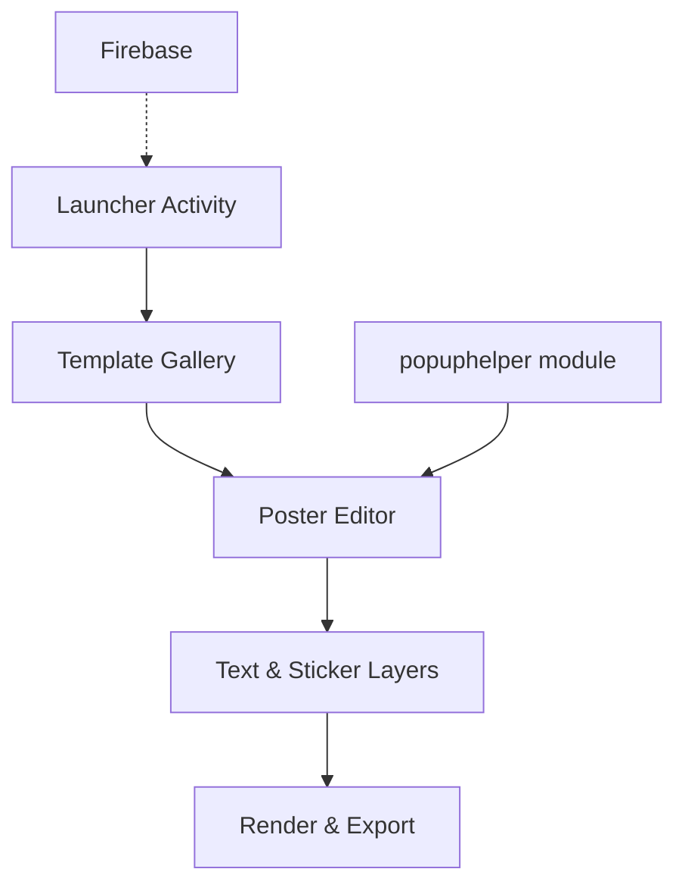

<p align="center">
  
</p>

> **Developed by [Arslan Malik](https://github.com/arsalanmaalik461)**
> 📱 WhatsApp: [+92 300 8987448](https://wa.me/923008987448) · 🌐 Website: [arslanmalik.tech](https://arslanmalik.tech)

---

## 🌟 Executive Overview

**AddBano** (Banner Festival Code) is a native **Android poster-maker application** built in Java. It lets users design festival greetings, event banners and promotional posters directly on their phone — pick a background, add text with stylish fonts, place stickers and share the finished design. The project ships as a complete Android Studio codebase (v1.3, `com.infiapp.postermaker`) with Firebase integration via `google-services.json`.

<p align="center">
  
  
  
  
</p>

## 📑 Table of Contents

- [✨ Features](#-features)
- [🖥️ App Showcase](#-app-showcase)
- [🏗️ Architecture](#-architecture)
- [🚀 Installation](#-installation)
- [📂 Project Structure](#-project-structure)
- [🛡️ Notes](#-notes)

## ✨ Features

| Feature | Description |
|---|---|
| 🖼️ Festival Templates | Ready-made banner backgrounds for festivals & events |
| ✍️ Text on Poster | Add custom text with fonts, colors and styling |
| 🌄 Backgrounds | Built-in gallery (`Sample poster`) plus custom images |
| 🔥 Firebase | `google-services.json` wired for analytics / push |
| 📦 Helper Module | `popuphelper` library module for reusable UI popups |
| 📖 Docs | HTML documentation bundled under `Documentation/` |

## 🖥️ App Showcase

| Screen | Purpose |
|---|---|
| Home / Templates | Browse festival banner templates |
| Editor | Add text, stickers and effects on the poster |
| Export | Save / share the finished design |

## 🏗️ Architecture



## 🚀 Installation

**Prerequisites:** Android Studio, JDK 11+, Android SDK 32.

```bash
# 1. Open the project
#    File → Open → "Banner Festival Code"

# 2. Add your Firebase config
#    Replace app/google-services.json with your own file

# 3. Sync Gradle, then run
./gradlew assembleDebug
```

Install the generated APK (`app/build/outputs/apk/debug/`) on a device running Android 5.0+.

## 📂 Project Structure

```
addbano/
├── Banner Festival Code/        # Android Studio project
│   ├── app/                     # Main app module (com.infiapp.postermaker, v1.3)
│   │   └── src/main/            # Activities, layouts, resources
│   ├── popuphelper/             # Reusable popup UI library module
│   ├── build.gradle / settings.gradle
│   └── gradlew
├── Documentation/               # HTML usage documentation
└── Sample poster/               # Sample poster assets
```

## 🛡️ Notes

- Replace `app/google-services.json` with your own Firebase project file before release builds.
- `local.properties` (SDK path) is machine-specific — do not commit personal paths.

---

<p align="center">
  <b>Developed by <a href="https://github.com/arsalanmaalik461">Arslan Malik</a></b><br>
  📱 <a href="https://wa.me/923008987448">+92 300 8987448</a> · 🌐 <a href="https://arslanmalik.tech">arslanmalik.tech</a>
</p>
